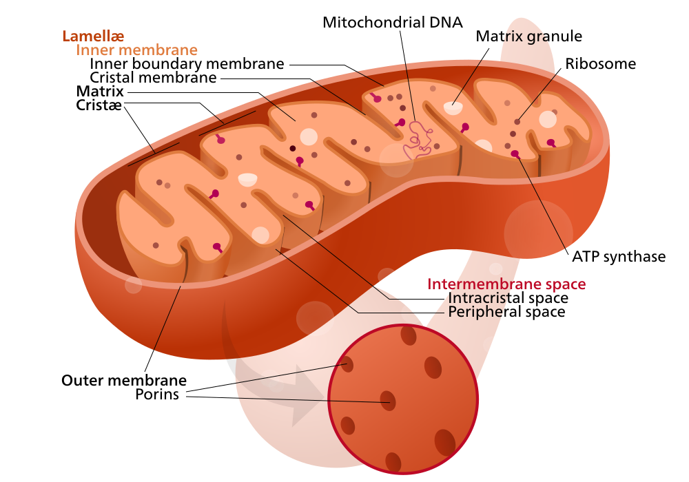

# Session 3 - Prepare your mitochondrial genome

## General introduction to sessions 3 to 5


In these three labs, you will work with mitochondrial genomes. Mitochondria are present in all eukaryotic cells (for a review, see 'Origin and diversification of mitochondria', Roger et al.), where among many other functions it supplies the cells with chemical energy (ATP). Here, we will focus on the genomes present in mitochondria; mitochondrial genomes present the advantage of being relatively small compared to nuclear genomes (e.g. 16,000 base pairs in humans), thus facilitating bioinformatic operations in the labs. They are also present in many copies in the cells, thus they are relatively easy to sequence even in extreme cases where DNA is often limited such as environmental DNA or ancient DNA studies. Although mitochondrial genomes can take many different forms depending on the species, they all contain a series of conserved protein-coding genes as well as rRNA and tRNA; this makes mitochondrial genomes good candidates for comparative analyses between different species.





**Figure 1: Simplified structure of a mitochondrion.** 
*By Kelvinsong; modified by Sowlos - Own work based on: Mitochondrion mini.svg, CC BY-SA 3.0, https://commons.wikimedia.org/w/index.php?curid=27731882*


During these three sessions, your main task will be to annotate the mitochondrial genome of one of the following organisms: *great apes, mouse, fruit fly or nematode Adapt depending on what we decide!!*. When you each have annotated the genome of your organism, you will compare and contrast your annotations with those from other students who worked on the other species. To complete this task, you will need what you learned during sessions 1 and 2, and you will use some parts of your annotated mitochondrial genome and that of your colleagues during sessions 6 to 8.

The steps you will follow in sessions 3 (assembling the genome) and 4 (annotation) are similar to what you would do if you were to annotate *de novo* an unknown mitochondrial genome. However, as the goal of these labs is mainly to familiarize yourself with bioinformatics rather than with annotation, we chose to work with model organisms (or close relatives of model organisms) for which annotated genomes are already available. This means that your task will be greatly simplified. But you should be able to use the same tools to annotate a new mitochondrial genome if you wish too!

## Introduction / Background information to session 3

You will receive a whole-genome assembly comprising nuclear and mitochondrial contigs of various sizes. Before you can start the annotation, you will need to reconstruct the mitochondrial genome, by identifying mitochondrial contigs and placing them in the right order so that they form a circular genome (we will work only with species with a circular mitochondrial genome). To do that, you will use different types of BLAST as well as a very useful command, `grep`. Moreover, you will need additional resources, which are described in the 'input' section. Once you have a circular genome, you will need to localize the canonical start (to orient the genome). After all of this is done, you will be all set for starting annotating in session 4!

The work flow described in this session could be followed for the four organisms mentioned in the introduction. However, the larger the genome of the organism and the longer the different steps will take. For that reason, you will work mostly on the genome of a nematode, Caenorhabditis remanei. The genome of the nematode Caenorhabditis elegans (a relative of Caenorhabditis remanei and a model organism) is ~100 Mbp long, while the human genome is ~3,000 Mbp long. For the last step, you will work on one of the four genomes (this will be decided at the beginning of the class).


**Figure 2: Map of the Human mitochondira**
By Emmanuel Douzery - Own work, CC BY-SA 4.0, https://commons.wikimedia.org/w/index.php?curid=46726514

## Goals

  + Prepare a circular, orientated mitochondrial genome for annotation.
  + Get familiar with the NCBI webpage and some of its content (tools, databases etc).

## Input(s)

  + an assembly (format: `fasta`) for Caenorhabditis remanei. This assembly consists of contigs which need to be assembled (in your case you are only interested in the mitochondria, so you will need to identify the mitochondrial contigs).
  + a set of proteins from a close relative of your species of interest (in this case, Caenorhabditis elegans). This will be used to identify the contigs belonging to the mitochondria in the assembly.
  + a library of short reads (format: `fastq`) for an individual for your species of interest (Caenorhabditis remanei). This will be used to bridge the mitochondrial contigs.

## Output(s)

  + a circularized, orientated mitochondria for your species of interest (format: `fasta`).
  
## Tools

  + command line blast
  + web-based blast
  + NCBI
  
## Steps

  + `blastx`: blast the assembly to the set of mitochondrial proteins to identify the mitochondrial contigs,
  + validate via web-based blast that the identified contigs are mitochondrial,
  + create a new fasta file with mitochondrial contigs,
  + tile,
  + orient to the canonical start location in the mitochondrial genome (cox1).

## Details

### Set up your working space

If you have not done so before, now is a good time to set up your working space on the cluster.

The course is accessible at: `/proj/uppmax2022-2-2/private/`

You will find data in: `/proj/uppmax2022-2-2/private/DATA/` and scripts in `/proj/uppmax2022-2-2/private/SCRIPTS`.

You should already have created your own folder under: `/proj/uppmax2022-2-2/private/RESULTS`. If you haven't, refer to session 1. Think about how you want to organize this folder. For example you might want a folder for each tutorial; you might also want to reproduce the DATA / SCRIPTS / RESULTS structure; etc.

### Identify the mitochondrial contigs in your assembly    

For this step you need two inputs: the assembly (.fna) and a set of proteins from a species related to your species of interest. The assembly contains many contigs from both mitochondrial and nuclear DNA. You need to identify the mitochondrial contig(s). For this you will use command-line BLAST between your assembly and a set of mitochondrial proteins from a related species. BLAST comes in different flavors, and thus it matters whether the sequences are coded as nucleotides or as amino acids.

The assembly is in a subfolder of: `/proj/uppmax2022-2-2/private/DATA/assemblies`

The set of proteins is in: `/proj/uppmax2022-2-2/private/DATA/coding_sequences`

Start by copying the assembly and the set of proteins to your own folder.

**Question 1.** Are the sequences for the assembly and the set of proteins in nucleotides or in amino acids? What is the format of these files?

Comment: the assembly file is compressed; use for example `zcat` to visualize it. **OBS If you do not know how to use a bash command, you can type "man *command_name*" on the command line (or google it).**

Before running BLAST, you need to make a database of the set of proteins. Because this is an intense process, you will work in an interactive window. Interactive windows are preferred to working in the login node (i.e. what you do when you log in to Uppmax) for all analyses that involve more computing power than e.g. `ls`. In fact, if you run heavy processes on the login node your session might be killed. When you ask for an interactive window, your request goes into the queue management system (SLURM) which might result in waiting times (usually a few minutes). Run the command below (which asks for a four-hours long interactive window with the smallest computing unit on rackham - the cluster we work on - a "node").

If you have to wait more than five minutes, you might try again asking for less time (one hour should be enough: `-t 1:0:0`). If it still does not work, tell the teaching assistants and we will offer you another solution.

```
interactive -A uppmax2022-2-2 -M snowy -p core -n 1 -t 4:0:0 --reservation=uppmax2022-2-2_1
```

For later: Once you have done everything you needed to do in the interactive window, you can exit by simply typing `exit`.

Then you should load module for the BLAST software. We are specifying version 2.9.0+. It is a good practice to always specify which version of the software you want to load to make sure that analyses can be reproduced.

```
module load bioinfo-tools blast/2.9.0+
```

You are going to modify file so **if you have not already done so, make a copy to your own folder (of the set of proteins) and work on that copy**. Then, adapt and run the following command:

```
makeblastdb -in path_to_the_protein_set/protein_set.fasta -dbtype nucl 
```
*Hint, `.fna` just means fasta nuclear, so it's also a fasta file. Give the program the name of the file you actually have.*

<!-- the dbtype could also be prot -->

**Question 2.** How many new files are created? Can you read them?

Now we are going to blast. We are going to use `tblastx`, but you can also try other types of `blast` and see what happens. It will take a bit of time to run, you can read the rest of the tutorial in the meantime. Adapt and run the following command, which might take a few minutes to complete:

```
gzip -dc path_to_the_assembly/assembly.fna.gz | tblastx -query - -db path_to_the_protein_set/protein_set.fasta -outfmt 6 -out outfile_name.blast
```

Comment: the first part of the command (`gzip -dc`) is because we need to decompress the assembly file before running blast.

**Question 3.** Open the output file. What do you see? Can you make sense of the different columns?

We are interested in column 11, as the best hits will have a low e-value. Adapt and run the following command; can you describe what it does? Adapt the threshold and see what happens.

```
awk '$11 < 0.0001 {print}'  < outfile_name.blast |wc -l
```

Now you have to identify which contigs have many regions with good hits. To do this you run the following command (think about the previous command output to define the e-value threshold - you might need a higher or a smaller value). **Take a minute to understand what this command does.** You can also come up with different strategies if you like.

```
awk '$11 < 0.0001 {print}'  < outfile_name.blast |cut -f1 | sort | uniq -c
```

**Question 4.** Write down the names of the contigs which came up.

### Validate via web-based blast that the identified contigs are mitochondrial

Now you have to validate that these contigs really belong to the mitochondria. You will use online blast and submit a fragment of the configs that you identified at the previous step. To select the fragments, use the bash command `grep` to find the contig in the assembly file. You will need the `-A` tag as well. Select a good chunk of the contig. **Caution!** Check whether your assembly file is an interleaved (i.e. the sequence is on multiple lines) or a sequential (i.e. the sequence is on a single line) fasta file. If it is interleaved, you need to convert it to a sequential fasta before using the `grep` command above. First, you should uncompress it (for example with `gunzip`). Then, you should have a python script from sessions 1 and 2 that does just that.

If not, or if you script does not allow for multiple entries in the fasta file, you can use this file: `/proj/uppmax2022-2-2/private/SCRIPTS/interleaved_fasta_to_sequential.py` with the following syntax (replace *your_input* and *your_output*):

```
python /proj/uppmax2022-2-2/private/SCRIPTS/interleaved_fasta_to_sequential.py your_input your_output
```

You will use the sequential fasta in the next step too. 

We will take a little detour as it is the first time that you work with NCBI in this course. Go to the [webpage](https://www.ncbi.nlm.nih.gov). It provides a lot of resources, databases, programs etc. It is easy to get lost... So before you start working with it you will perform a few tasks to get familiar with it and get an idea of what it can offer you.

**Question 5.** First, click on 'Analyze' in the middle of the page. Check the available tools and make a list of the tools that you think will be useful for this course.

**Question 6.** Go back to the main page. Left of the search field, you have a drop-down menu listing the different databases. Again, which ones do you think will be relevant to us? And where did the input files you received in this lab come from? If you want to see the starting page for a given database, select it in the menu and click 'Search'.

Go back to the main page if you left it and find the BLAST page, then choose nucleotide blast. Paste the chunk of sequence that you selected with the `grep` command above into the dialog box. Below the BLAST button, select 'Show results in a new window'. All other parameters can be kept as default. Perform the blast.

**Question 7.** Does the fragment belong to a mitochondria? Does it belong to the species you are interested in?

Repeat this with each of the contigs that you identified at the previous step (if you have identified many contigs, you can focus on the six most frequent ones). Keep track of the contigs which do belong to the mitochondria of your species of interest.

### Create a new fasta file with mitochondrial contigs

You have identified one or several contigs (usually one to four) belonging to the mitochondrial genome of your species of interest. The next step is to get a continuous DNA sequence. This will be done in this and the next step. Even if you have already a single contig at this stage, please go through the steps! In this step, you will prepare a fasta file that will allow you to perform the next step - 'tiling'.

First, create a fasta file for each of the mitochondrial contigs. The fasta file should include a header and the sequence. Adapt and modify the following command:

```
grep -A1 name_of_contig path_to_the_assembly/assembly.fna > path_to_output/contig.fna
```

Second, create a single fasta file with the different contigs fasta files. You can, for example, use the command `cat`. If you do not know how to use `cat`, try `man cat` for information about that command. If you have a single contig, try to create a file with several copies of that contig (do not use it for the next steps though, it is only for training!).

### Tiling

You now need to connect the different contigs in your file to create a continuous circular sequence. This is the step called 'tiling'. Your contigs may come from different strands (+ or -). You won't be able to connect a contig from the + strand to a contig from the - strand. Thus the first step of the tiling is to obtain the reverse-complement for each of your contigs. You can do that by visiting this [webpage](https://www.bioinformatics.org/sms/rev_comp.html). Alternatively, you can use the script that you wrote during session 2 (Question 3).

If you use the web tool: Paste your contig sequence into the search box and reverse-complement it. Now add that new sequence to your fasta file (do not forget to add an informative header!). Repeat for each of your contigs.

## Part 2 - working on your study species


This is the step when you start to work with one of the four species that you were assigned at the beginning of the class (see Table 1 below, left column). If you forgot which species you were supposed to work with,check under groups in Studium.

For this exercise, you can imagine that you are the first researcher working with the mitochondria of a newly sequenced organism. Your task is to figure out where all the important protein-coding genes, tRNAs, and rRNAs. Since this is the first time someone is working with this species there is nothing known but you can use a closely related species that is already sequences as a reference to fill in the blanks. 


You are ready to connect the different contigs! For that, you will use another resource: short reads data from an individual of your species of interest. Indeed, there may be gaps between the contigs that you have now. To get a continuous molecule, you need to fill these gaps. This is schematized in Figure 1.


***Figure 3: An illustration of tiling.** Let’s say you have three assembled contigs that you have identified as mitochondrial: Node 12, Node 26, and Node 83 (black lines). You will use reads from the .fastq file (purple lines) to bridge the gap between these three contigs. The blue lines are the sequence that you identified and used to attach the respective contigs to each other for a complete, but not yet circularized mitochondrial genome. Taken from Pogoda et al. A guide to organellar genome assembly and annotation.*

Your task now is to select a library of short reads for an individual of your species of interest. A good place to find that is NCBI. So, open the start page of NCBI again. In the 'All Databases' drop-down menu, choose 'SRA'. 'SRA' is short for Sequence Read Archive.

**Question 8.** Search for your species of interest. How many results do you get?

Most likely your first search resulted in a lot of results. This is expected as you work with model organisms! On the left side of the result page, you have different categories of data and information about the number of results in each of these categories.

**Question 9.** Narrow down the search by selecting some of the categories of data. Think about what you learned about the different sequencing technologies. How many results do you get once you narrowed the search? (write down the criteria you used) You can test different combinations of criteria. Now that you narrowed down your search, open a few of the results and read the information that is provided. For example, what is the size of the file? When was it published? What do you know about the particular sequencing strategy that was used to generate the data?

As you might have noticed, there is a bit of everything in the results. To make it easier for you, we already selected a library of short reads for your species. You will find it in a subfolder of: `/proj/uppmax2022-2-2/private/DATA/sra/`.

**Question 10.** What is the format of the file? Do you understand what the different lines are? How long are the reads? 

Now a days doing tiling has become less and less common as long read sequencing has becom more common place. If your read are longer than the mitochodria you are sequencing it's quite easy thing to assemble it!

In the real world you would have now to start going through this procces of tiling and circularizing your mitochondrial seqeuences, but the interest of time we have, as any good cooking show, prepared this step in advance.
You can find the prepared mitochondrial fasta files here: `/proj/uppmax2022-2-2/private/DATA/mitochondrial_genomes`

Copy over the correct one to your working directory!

### Orient to the canonical start location in the mitochondrial genome (*cox1*).

We now have a circular mitochondrial genome (thanks to all that hard tiling work we did). The last step is to orient the sequence according to the canonical start location. By convention, non-model organisms' mitochondria are oriented with the *cox1* gene as the first gene of the genome. To do that, you will do a pairwise alignment. But first, you have to find a sequence to compare your mitochondrial sequence to. Open an NCBI blast window and select nucleotide blast. Paste or upload your mitochondrial sequence.

**Question 11.** To which organism does the best hits belong?

Since you are working with well studied organisms, most likely the first hit will align perfectly to the mitochondrial genome of your species. To make it a bit more interesting, **we are from now on going to  a close relative of your species instead of your species itself**, this is called using a 'reference', that is using a known species to gather information about an unkown one. You are going to recover the appropriate sequence from NCBI. Use the table below to see which species you should be looking for depending on your starting species.

***Table 1. Pairs of study organisms / close relative.***

Study organism ("start species") | Close relative 
---------------|---------------
Caenorhabditis remanei (nematode) | Caenorhabditis elegans (nematode)
Phodopus sungorus (hamster) | Mus musculus (mouse)
Drosophila simulans (fly) | Drosophila melanogaster (fly)
Pongo abelii (orangutan) | Homo sapiens

Go to your new favorite webpage (i.e. NCBI ;) ). We will detail one way to find the mitochondrial genome of the close relative. There are more ways, feel free to explore!

In 'All Databases' choose 'Genome' and then under 'Custom resources' choose 'Organelles'. On the new start page, under 'Using organelles resources', choose 'Browse by organism'. Write the name of the species in the search bar. Choose the genome with the **oldest** release data.

**Question 12.** What is the size of the mitochondrial genome? What is the identifier of the sequence? (there might be several identifiers)

Then click on the identifier. You should be taken to a page that looks like that [one](https://www.ncbi.nlm.nih.gov/nuccore/NC_002008.4), except for your close relative. If that is not the case, try again or ask the teaching assistants. This page comprises a lot of information, including annotations. You want the sequence of the *cox 1* gene. Search for it on the page (you might have to change case, e.g. COX1, or search for COI). You should get two matches, one for the gene and one for the coding sequence (CDS). Look at the information, in particular which translation table is used, and other details (particularly important for those of you working with the nematodes and the flies). Click on the CDS link and open it in a new window. You should have something similar to the entire mitochondria but very reduced in length. To download the fasta file, click on 'FASTA' (under the name of the sequence). Once the page changed, click on 'Send to' in the top right of the page, make sure to choose 'Complete Record', and select 'File' as file destination. The format should be FASTA. This will open a text file with the sequence - save it in an appropriate location with an appropriate name.

Comment about NCBI: as you might start to notice, you can access a given page of NCBI (e.g. the page of the mitochondrial genome) in several different ways, using different identifiers etc.

**Question 13.** Estimate the length of the *cox 1* coding sequence with the command `wc -m`. Does it match with the information in the fasta header? If it does not, you can try to transform your record into a sequential fasta file; is the output of `wc -m` different? What do you think has happened?

Now you are ready to orient the mitochondrial genome of your "study species" with the *cox1* gene you just obtained. Once again, go to NCBI webpage, choose BLAST and then 'tblastx' (the tblastx option might not show up in the blast starting page - in that case choose one of the other types of blast and then you will find a tblastx tab). Then choose "align two or more sequences". In the top dialog box, copy or upload the mitochondrial genome of your study species. You need to choose which genetic code is going to be used to translate your nucleotide sequence. Choose between: "Vertebrate mitochondrial" and "Invertebrate mitochondrial". In the bottom dialog box, copy or upload the *cox1* fasta file. Then choose the option "open results in new window" next to the BLAST button and blast. In the new window there are different tabs. Choose the tab "Dot Plot". You should see a line (possibly fragmented) with an increasing or a decreasing slope.

If the slope is decreasing, you need to reverse complement your mitochondrial genome. Scroll up this page for instructions on how to reverse complement! Save your genome in a new fasta file and repeat the tblastx step.

Now that you have a line with an increasing slope, look at it. Where does it start? Most likely it starts in the interior of the genome. You need to make that start position the new start of the genome. Now go the "Alignments" tab.

The last part of these explanations are based on 'A guide to organellar genome assembly and annotation', Pogoda et al. as their explanations are very good!

The top sequence is your species’ *cox1* amino acid sequence (or most of it), and the bottom is the *cox1* amino acid sequence of the reference you chose (the close relative). Note that the amino acid sequences are very similar in some places (conserved), but diverge in other places in the protein. This is simply due to evolution of this protein over the millions of years since the common ancestor of these two different organisms. Some of this divergence may have occurred at the beginning amino acids of the protein, in which case the alignment position of the reference sequence may not start at amino acid number one, which corresponds to the bottom of these two sets of numbers being equal to one (or to 3, as the start codon might not be included in the *cox1* sequence you obtained for the reference sequence). Although *cox1* is highly conserved, tblastx may not have found an alignment that begins at the start methionine (M) of the protein. However, the alignment should start very near the beginning, within a couple of amino acids from the start methionine of the protein, which is encoded for by an ATG. If you are working with nematodes or flies, the start codon might be different (ATT, ATA, ATC, GTG, TTG).

It is also possible that the alignment is broken in several pieces. In that case, scroll down the page (usually the top alignment is the longest and then come shorter ones) and see whether you can find another alignment which could complete the longest one. Caution! Make sure that the two (or more) alignments are in the same translation frame (right most information in the header of the alignment result). If not then try to find the alignment with the position closest to the start of the *cox1* gene to perform the step describe in the next paragraph.

While there are likely to be many start codons throughout your *cox1* gene sequence, the one we are looking for should be very near the position given by the top number in the alignment (the top number is the nucleotide position in your genome). Just how near will be roughly three times the number of amino acids from the start of the alignment as given by the bottom number (this is because there are three nucleotides for every one amino acid). Take the bottom number, and subtract it from the top number. Go to this nucleotide position in your text editor and search for one of the start codons very nearby. This should be the new start of your genome. 

The start and end positions of a contig put together by the assembler are arbitrary within both the strand and the position along the circular genome. Therefore, it is up to us to orient the genome to the canonical *cox1* start. Once the start codon has been found, place your cursor before the first base pair in your text editor and hit enter. This will put the first nucleotide of the *cox1* gene as the first nucleotide of the genome. Because of the circular nature of this genome, the sequence that used to come before this start codon can simply be added onto the end for the genome to remain circular and complete.

If you cannot find the start codon, perform the step above with the first position in the alignment.

You now have a *cox1* oriented genome!

**Question 14.** What is the position (in base pairs) of the first nucleotide of the start codon in your study species? (before you oriented it) You can validate your answer by finding it on NCBI on the page of the mitochondria of your study species.

---
## Report:
Please sumbit a text file with the answers to the following questions: 4, 6, 7, 8, 12, 14.

---

This is the end of the lab, please make sure that you completed and wrote down the answers to all of the questions.
Also, make sure to delete any files that you no longer need - you can copy them somewhere else if you want to keep them. This goes for both the Unix computers and Uppmax.
