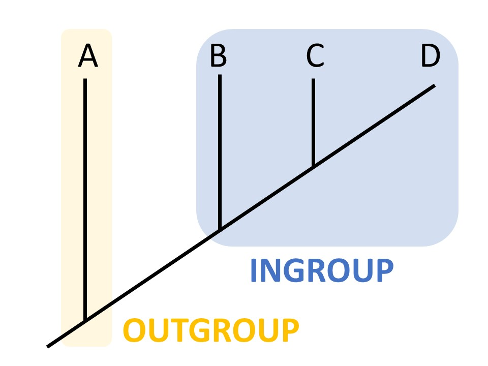

# Session 6 - project
For the following three labs you will work on a bioinformatics project where you will try to answer one of the evolutionary biology questions below, using phylogenetic methods. You will be randomly assigned one of the questions. During the first lab, you will gather your own dataset for the analysis. During the second lab (session 7), you will align the dataset and create phylogenetic trees. During the third and last lab (session 8), you will plot the threes and wrap-up the project.

We (the lab assistants) will help and guide you through the assembly of your dataset so that you end up with a suitable dataset, but ultimately the choice of samples is yours. 

We made a checklist to help you when a command does not do what you expect it to do [here](Troubleshooting_checklist.md). It includes instructions to use `SFTP` to transfer files to and from Uppmax.


## Questions:
1. Are bats more closely related to horses than to cows?
  
2. Do marsupials form a monophyletic group (i.e. clade)?

3. Both whales and dugongs originate from landliving animals. Did this land-to-water transition occur twice independently?

4. Are salamanders more closely related to frogs than to lizards?

5. What are the closest relatives of octopuses and squids?

6. Is the guinea pig more closely related to rats than to pigs?

7. What feline (cat-like animals) is most closely related to the cheetah?

8. Are egg-laying mammals (platypus and echidna) more closely related to marsupials than to placental mammals?


### Pointers

When choosing your species you need to think about what species you want to test/compare i.e. your ingroup as well as your outgroup. Including an outgroup is very important to root the phylogenetic trees. See the picture below: 


_By Ngilbert202 - Own work, CC BY-SA 4.0, https://commons.wikimedia.org/w/index.php?curid=63950569_

The test in the above figure would have been to see if `C` is more related to `B` or to `D`, and the answer would then be that `C` is closer to`D` (they share one more common ancestor). 

If you are unsure what would be an appropriate outgroup for your question, ask us!

* **Question 3**: You will of course need some whales and dugongs but also several different clades of landliving mammals to determine the potential closest relatives.

* **Question 5**:  In order to be able to answer this question you will need to have species from _several_ different distinct lineages as well as a few squids/octopuses. 


**N.B.** Since you are going to produce quite a lot of files, try to use self-explanatory files names and a good structure of folders. It will make your work easier. It might be a good idea to write a short description about how the archive is organized and where the files are (trees, scripts, alignments and so forth).


## Gathering your data

First start by actually selecting what species you should use. Think about what ingroups you need to answer the question and what could be a good outgroup. 
If you have a hard time coming up with good candidate species you can use the [taxonomy browser](https://www.ncbi.nlm.nih.gov/Taxonomy/Browser/wwwtax.cgi?mode=Root).

You should have around 15 species (15-20) in your dataset. 

**Question 1**: Write down a few sentences on the selection of species and outgroup in your dataset. Which species did you choose and why?

**Comment**: it is possible that you do not find data for some of the species. In that case, update your answer accordingly and add more species if needed.

This will help you later to reflect upon the question and your results. It also help us (the teaching assistants) to check that you will be able to answer the question you were given.


## Getting the sequences
This should be familiar to you, since you have had to find and download sequences before.
Your task is to gather the full mitochondrial genomic sequences for your species as well as the gene *CytB* (Cytochrome b). You should thus have two fasta files per species!

#### Method A - preferred
* Go to the [NCBI browser for organelles genomes](https://www.ncbi.nlm.nih.gov/genome/browse#!/organelles/). 

* On the top right click filter and select `mitochondrion`.
* Then search for your species. For the *cytB* part you need to make sure that you select a mitochodria that is annotated (scroll down and see if there are genes and coding sequences listed).

* Click and download the fasta file for the entry as you have done several times before. 


#### Method B - if A doesn't get you what you want

* Use BLAST to find sequences that are not in the curated "nice" list of organelles. 

* Start with one of the species for which you have the sequence. 

* BLAST that sequence to find related sequences 

OBS! Before choosing a sequence have a look at its length - the hits should not be much shorter than the query. Additionally, as a sanity check, you should see that all of your sequences have a relative similar position on the mitochondrial genome (except possibly your outgroup sequences).

#### If you cannot find the two sequences (entire mitochondria and *cytB*) for some species

Preferably you should get the two types of sequences for all species in your dataset. It might be that you decided to include a species but could not find both sequences for it. In that case, try again with a close relative. If it is really difficult for you to find enough species with the two sequences for your dataset, ask a teaching assistant and we will look for a solution together.

Save your files with clever, distinguishable names.

#### Create fasta files for the entire dataset

Once you found all the sequences for your dataset, you will need to put them together in a single fasta file (OBS! One fasta file for the entire mitochondria and one for *cytB*) the same way you did in Session 5 (use the `cat` command for example).

## Create a name conversion file.

Create two (one for the mitochondrial sequences and one for *cytB*) **tab-separated** files with three columns. I.e. there should be a tab charachter `\t` between each column.
The files should contain one row for each sequence in your data set, including: 

 * a maximum 8-character short-name (enough for you to identify it: e.g. c\_Vurs or mt\_Vurs)
 * an easy-readable name (good for presentation to others: e.g. cytB\_Vombat\_ursinus mitoc\_Vombat\_ursinus)
 * The header you got when dowloading it from NCBI (or if you have changed it already your own long header)
  `MN443013.1 Providencia stuartii strain PS11 subclass B1 metallo-beta-lactamase NDM-1 (blaNDM) gene, blaNDM-1 allele, partial cds`
  
  ```
  c_Vurs cytB_Vombat_ursinus MN443013.1 Providencia stuartii strain PS11 subclass B1 metallo-beta-lactamase NDM-1 (blaNDM) gene, blaNDM-1 allele, partial cds
  H_sapeins cytb_Homo_Sapiens 
  
  ```


**Question 2** Now you should write a Python script that takes one of your merged fasta file as input (which has one of the three types of headers in the conversion table), as well as your conversion table, and then can switch between the three different header types. Your script should for this task change the original file you send in, not create a new fasta file!


* Further clarification, it should be able to change wich types of header is saved by an option from the user, from one to another and back again.


Submit the script, the two conversion tables and one of the fasta files for *cytB*.

Tip: When your script is reading the table remember that your columns are tab separated, you can use that differentiate between your different columns. 
Remember that you can `sys.argv` to get inputs from the commandline.


## REPORT

Please submit the answer to Question 1 (text) and to Question 2 (a Python script, two conversion tables and the merged *cytB*-fasta file).

---

This is the end of the lab, please make sure that you completed and wrote down the answers to all of the questions.
Upload the **scripts** (code) that you were asked to submit to studium **in the original format** (i.e. .py or .sh), no `pdf` or word files! Any answers that are not code should of course be in text formats such as `.pdf, .txt & .docx`.
Also, make sure to delete any files that you no longer need - you can copy them somewhere else if you want to keep them. This goes for both the Unix computers and Uppmax.
